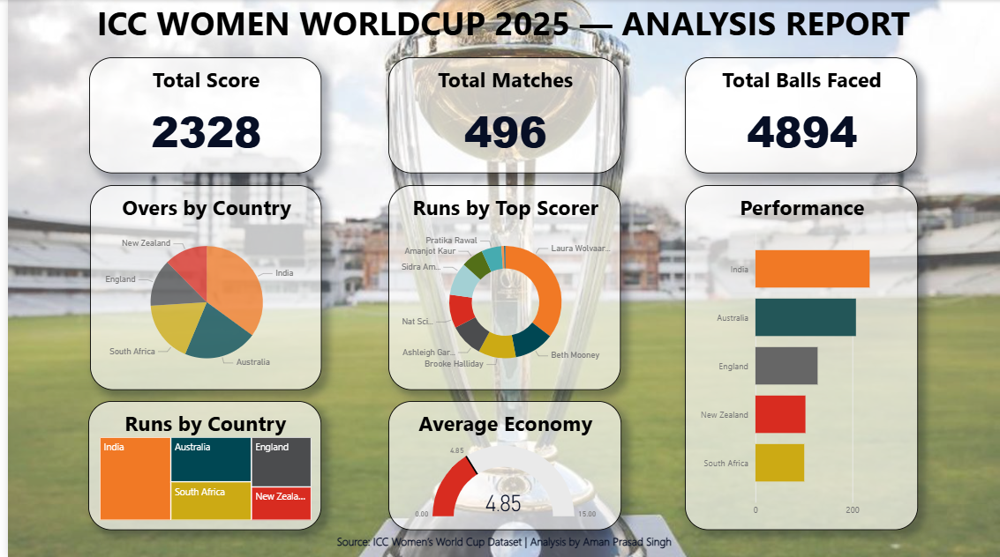

# Women's T20 World Cup 2025 – Power BI Analysis Dashboard

A Power BI dashboard analyzing key statistics from the ICC Women's T20 World Cup dataset.

## Dashboard Overview
This report visualizes tournament data to highlight team performance and scoring trends.

### Key Insights Visualized
- Total tournament score, matches, and balls faced
- Runs distribution by country
- Player scoring distribution
- Team performance trends
- Average economy rates

## Tools Used
- Power BI
- Data Visualization
- Exploratory Data Analysis

## Dashboard Preview

Note: The original `.pbix` project file is unavailable. The repository includes a screenshot of the completed dashboard created for academic analysis.
